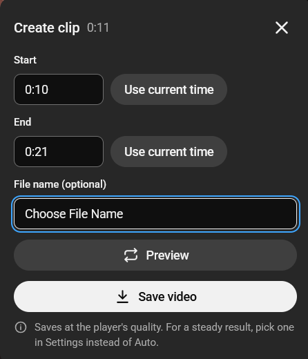

# Clipper for YouTube
A Firefox extension that lets you clip part of a YouTube video and save it as an MP4 to share.

> **Status:** version 1.1.0 works in Firefox and Chrome. The Firefox version is waiting for review on
> addons.mozilla.org; see [Install](#install).



## Features
- A **Clip** button in the YouTube player, and beside Shorts next to Share.
- Set a start and end time, typed or taken from the current playback position.
- Preview the clip before saving.
- Save the clip as an MP4 at the quality and size you're watching, to share anywhere.

No accounts and no servers: everything happens in your browser.

## Install


### Firefox
Either way works:

- **From addons.mozilla.org** (updates automatically).
  **TODO (owner)**: add the listing link once it's published.
- **From GitHub:** download `clipper-for-youtube-<version>.xpi` from the
  [latest release](../../releases/latest) and open it in Firefox (drag it into a Firefox window, or use
  **File → Open File**), then click **Add**. It's the same file Mozilla signs for the store; Firefox
  only installs signed extensions permanently.
- **Unsigned test build** (while the store review is pending): `youtube-clipper-<version>-firefox-unsigned.zip`
  from the [latest release](../../releases/latest).

  **Any Firefox, temporarily:** open `about:debugging` → **This Firefox** → **Load Temporary Add-on**
  and pick the zip. It's removed when Firefox restarts.

  **Permanently, in Firefox Developer Edition, Nightly or ESR** (regular Firefox doesn't allow
  unsigned add-ons):

  1. Open `about:config`, accept the warning, search for `xpinstall.signatures.required` and
     double-click it so it shows `false`.
  2. Rename the downloaded `.zip` so it ends in `.xpi` (it's the same file; Firefox's install dialog
     only lists `.xpi` files). If Windows hides extensions, turn on **View → Show → File name
     extensions** in File Explorer.
  3. Open `about:addons`, click the gear icon (⚙) → **Install Add-on From File…**, pick the `.xpi` and
     click **Add**.

  It stays installed after restarts. When the signed version comes out, installing it replaces this
  one (same extension ID), and you can set `xpinstall.signatures.required` back to `true`.

### Chrome
The Chrome Web Store doesn't allow extensions that save YouTube videos, so on Chrome you install it
yourself from GitHub:

1. Download `youtube-clipper-<version>-chrome.zip` from the
   [latest release](../../releases/latest).
2. Unzip it into a folder you'll keep. Chrome loads the extension from that folder, so don't delete it.
3. Open `chrome://extensions` and turn on **Developer mode** (top right).
4. Click **Load unpacked** and choose the unzipped folder.

The clip button then appears on YouTube videos. Chrome doesn't update extensions installed this way.
To update, download the new release, replace the folder's contents, and click the reload arrow on the
extension's card in `chrome://extensions`.

## Run from source
Requirements: [Node.js](https://nodejs.org) 24 and Firefox.

```bash
npm install
npm run dev
```

`npm run dev` opens Firefox with the extension loaded and reloads it on every change.

## Build
```bash
npm run build
```

The build goes to `.output/`. To try it in your normal Firefox, open `about:debugging` →
**This Firefox** → **Load Temporary Add-on**, and pick the `manifest.json` in the build folder.

## Usage
1. Open a video or a Short on youtube.com.
2. Click **Clip**: in the player controls on a video, or in the buttons beside a Short (under Share).
3. Set the start and end, preview it, then **Save video** and share the MP4.

## Tech
[WXT](https://wxt.dev), TypeScript, React 19, plain CSS, Vitest, and
[Mediabunny](https://mediabunny.dev) for converting recordings to MP4. Manifest V3 for Firefox.

## Credits
- [Mediabunny](https://github.com/Vanilagy/mediabunny) by Vanilagy, used unmodified under the
  [Mozilla Public License 2.0](https://www.mozilla.org/MPL/2.0/). Its source is available from that
  repository and from npm.

## License
[MIT](LICENSE). Mediabunny, bundled unmodified, stays under its own licence (see Credits).
